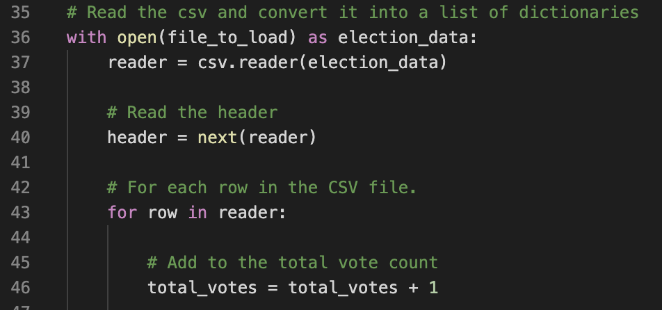
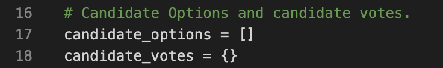
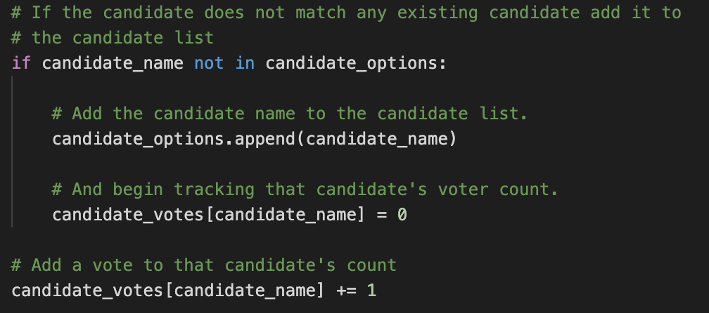
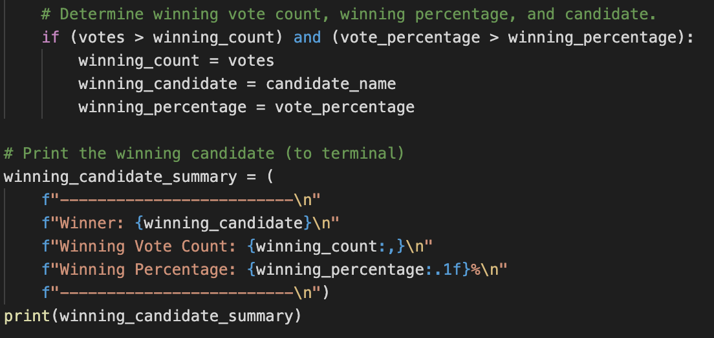
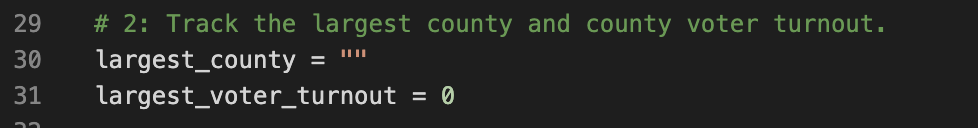
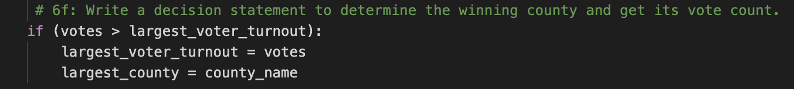
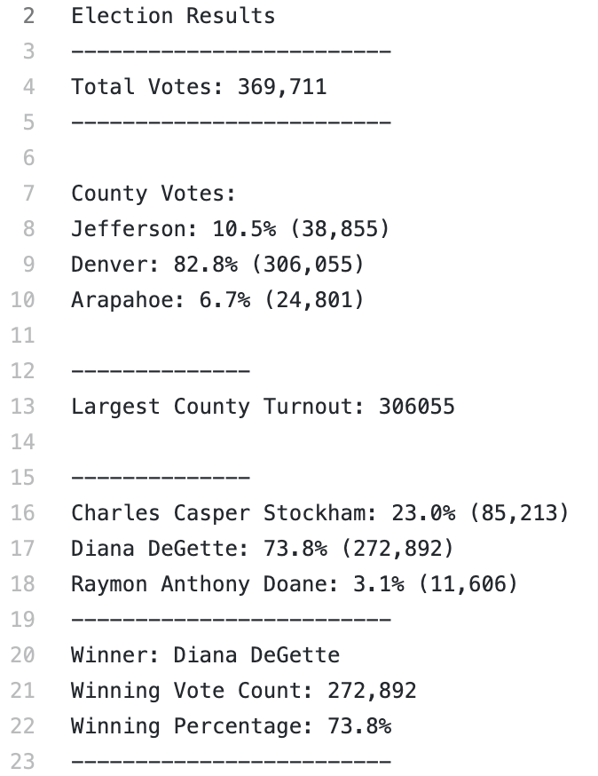

### Election Audit Analysis

## Project Overview
Seth and Tom, two employees of the Colorado Board of Elections, have to complete an election audio of a recent local congressional election. The audit should include the total number of votes, a complete list of candidates who received votes, the total number of votes for each candidate, the percentage of votes for each, and the winner of the election based on the popular vote. They sought to automate this process with python instead of utilizing Excel, and thus we have built a script to make this process more efficient and useful for other elections. 

## Resources
Data source: election_results.csv
Software: Python 3.7.6, Visual Studio Code 1.47.3

## Election Results
- Total number of votes cast: 369,711 votes.

- Charles Casper Stockham received 85,213 votes (23% of the votes), Diana DeGette recieved 272,892 votes (73.8% of the votes), and Raymon Anthony Doane received 11,606 votes (3.1% of the votes).

- Diana DeGette won the election with 73.8% of the votes.

- Three counties participated in the election: Arapahoe, Denver, and Jefferson. Jefferson had 38,855 votes (10.5%), Denver had 306,055 votes (82.8%), and Arapahoe had 24,801 votes (6.7%).
  - Here a similar process to the candidate vote tabulations were used, simply substituting variables for ones related to the counties.

- Denver had the highest voter turnout with 82.8% of the total votes cast in this election.

----------------------------------

## Summary
For this project, we have successfully automated the ability to summarize the election results of a recent congressional election, given ballot ID, county and candidate. We wrote a script using Python 3.7 that tallied the votes for each candidate, the percentage of votes each candidate received, and the breakdown of voting totals by county. From this process, we found that Diana Degette won the election and that Denver had the largest voter turnout of the three counties.

Now that we have this script, it can be continually modified for the Colorado Board of Elections to use on future elections with more analysis and output. With additional data such as the number of registered voters per county or candidate's party, we can add a number of new variables and outputs. For example, with the candidate's party we can add lines to determine whether or not a county voted Democrat or Republican and by what percentage with very similar if statements and for loops that already exist in our code. Additionally, with the number of registered voters per county, we can gain more insight into the largest voter turnout number, where we can see how many potential voters there are and what percentage of them actually cast their ballot.
